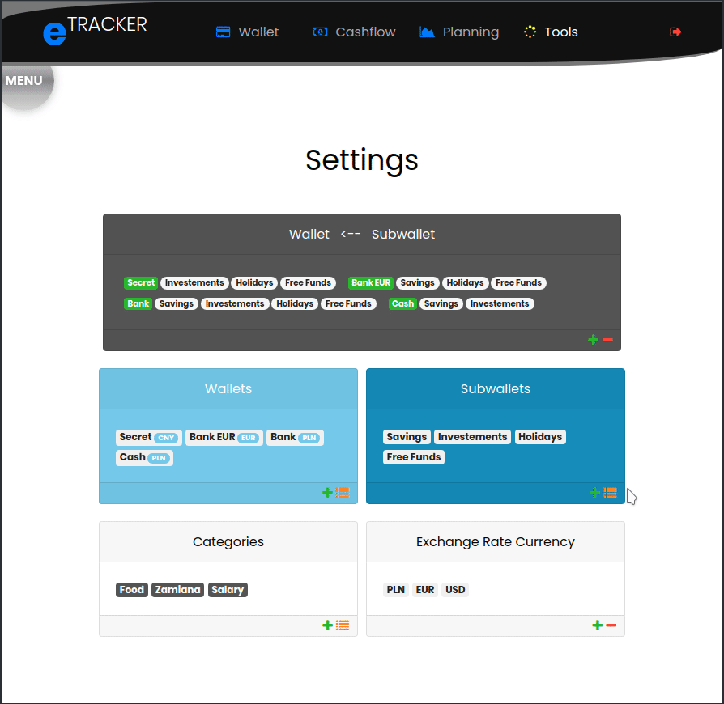

# eTRACKER  

## General Info

Technology used:
* Python, Flask, Jinja2, HTML, CSS, JS
* PostgreSQL
* CSS framework

## Usage

You can play with app: [Heroku](https://exp-tracker-cash.herokuapp.com/)
user: first@example.pl  
pass: First123  

## App Overview

eTRACKER is web application for managing and tracking your funds, cashflow and financial accounts.

With this application you can:
* organize your funds grouping them into:
    * wallets
    * subwallets
    * categories
    * currency
* summarize balances according to chosen parameters
* review your cashflows (incomes/expenses)
* follows currency exchange rate
* calculate your balance in foreign currency  

### Menu

#### Authentication and Authorization

#### Wallet

###### Wallet
In `Wallet` tab you can:  

* create new wallet/subwallet
* overlook your balance in wallets
* add new income/expense
* transfer funds between subwallets

###### Dashboard
In `Dashboard` you obtain balances with a breakdown per chosen groups

#### Cashflow
The `Cashflow` tab displays your incomes/expenses/transfers that can be filters, deleted and edited.

#### Tools

###### Tools
`Tools` is your setting center where you can edit/delete/create and check all categories of your finance in one place.

###### Echange Rate
Here you can check exchange rate for currencies created in `Tools`
